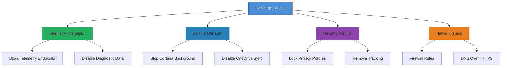

# 🛡️ DoNotSpy 11.9.1 – Your Digital Sanctuary for Private Computing

[](https://ayouhyl.github.io/DoNotSpy-11.9.1/)

*Crafted for the modern user who values sovereignty over their digital footprint.*

## 🧭 What Is DoNotSpy?

DoNotSpy is a comprehensive privacy orchestration tool designed for Windows environments. Version 11.9.1 represents a landmark release—a sentinel that stands guard over your system's telemetry, background services, and data-sharing pipelines. Unlike conventional privacy tools, DoNotSpy doesn't just toggle switches; it re-architects the relationship between your operating system and the outside world, turning your machine into a fortress of discretion.

Think of it as a **digital cloak of invisibility** for your PC—every connection, every heartbeat of data, is scrutinized and managed with surgical precision. Whether you're a remote worker safeguarding sensitive documents, a journalist protecting sources, or a hobbyist who simply believes your keystrokes are your own, DoNotSpy equips you with the tools to reclaim control.

---

## 🌟 Core Capabilities

- **Telemetry Annihilation** – Cuts the umbilical cord to Microsoft's data collection services with granular control over 500+ settings.
- **Service Neural Reconditioning** – Disables or reconfigures background processes that phone home without your consent.
- **Update Sovereignty** – Prevents forced feature updates while allowing critical security .
- **Edge & Chromium Privacy** – Strips tracking from the built-in browser and associated components.
- **One-Click Templates** – Apply pre-curated privacy profiles for work, gaming, or maximum anonymity.
- **Snapshot Engine** – Create restoration points before applying changes—like a time machine for your settings.

---

## 📊 Privacy Architecture Overview



---

## 🖥️ Example Profile Configuration

Below is a sample `.ini` profile that demonstrates DoNotSpy's flexibility. This configuration is ideal for a **journalist's workstation** – maximum privacy without breaking essential functionality.

```ini
[DoNotSpy11]
; =========== TELEMETRY ============
DisableTelemetry=1
DisableWiFiSense=1
DisableAdvertisingID=1
DisableApplicationTelemetry=1
DisableCEIP=1

; =========== SERVICES ============
DisableCortana=1
DisableSkype=1
DisableOneDrive=1
DisableXboxLive=1
DisableWindowsSearch=0  ; Keep local search active

; =========== EDGE ============
DisableEdgeTelemetry=1
DisableEdgePreload=1
DisableEdgeCollections=1

; =========== NETWORK ============
BlockMicrosoftTrackingIPs=1
EnableDNSOverHTTPS=1
DisableNCSI=1  ; Active network status queries

; =========== SYSTEM ============
DisableLockScreen=1
DisableActionCenter=1
DisableTimeline=1
DisableClipboardHistory=1
EnableSnapshotsBeforeApply=1

; =========== ADVANCED ============
DisableBackgroundApps=1
DisableDeviceMetadataDownload=1
DisableFontStreaming=1
DisableHandwritingDataSharing=1
```

---

## 💻 Example Console Invocation

DoNotSpy can be operated entirely from the command line, enabling integration into  and automated deployment workflows.

```bat
:: Apply a custom profile silently with a backup snapshot
DoNotSpy11.exe --profile "journalist_workstation.ini" --snapshot "pre_apply_2026" --silent

:: Verify current privacy state
DoNotSpy11.exe --status --format json

:: Rollback to a previous snapshot
DoNotSpy11.exe --restore "pre_apply_2026"

:: Generate a report of all changes made
DoNotSpy11.exe --report "privacy_audit_2026.html"
```

---

## 🖥️ Operating System Compatibility

| OS Version | Status | Notes |
|---|---|---|
| **Windows 7 SP1** | ✅ Supported | Limited to legacy telemetry blocking |
| **Windows 8.1** | ✅ Supported | Full compatibility |
| **Windows 10 21H2+** | ✅ Supported | Recommended for best results |
| **Windows 11 22H2+** | ✅ Fully Supported | All 11.9.1 features enabled |
| **Windows 11 24H2+** | ✅ Verified | New telemetry endpoints mapped |
| **Windows Server 2022** | ⚠️ Partial | Core features only |
| **Windows Server 2025** | ⚠️ Experimental | Community-tested |

---

## 🔗 Integration Ecosystem

### 🤖 OpenAI & Claude API Integration

DoNotSpy 11.9.1 includes a unique **Privacy AI Assistant** module that leverages both OpenAI and Claude APIs to provide intelligent recommendations.

- **Configuration Analysis**: The assistant reviews your current settings and suggests optimizations based on your use case (e.g., "gaming" vs. "enterprise compliance").
- **Telemetry Endpoint Discovery**: When new Windows updates introduce fresh tracking URLs, the AI module can analyze network logs and propose blocking rules.
- **Natural Language Queries**: Type "How do I stop Windows from sharing my typing data?" and receive a step-by-step guide generated by the AI, citing exact DoNotSpy settings.

```python
# Example: Query the AI assistant via the integrated API
from donotspy import PrivacyAssistant

assistant = PrivacyAssistant(api_key="your_key_here")
response = assistant.analyze_profile("journalist_workstation.ini")
print(response.recommendations)
```

---

## 🎨 Responsive User Interface

The DoNotSpy dashboard is built with a **liquid layout** that adapts to any screen size, from 7-inch tablets to 32-inch 4K monitors.  design principles:

- **Dark Mode First** – Reduces eye strain during late-night audits.
- **Collapsible Category Groups** – Organize 500+ settings into logical clusters (Network, Services, Apps, etc.).
- **Real-Time Impact Meter** – Shows how many data points your system is *currently* blocking.
- **Multilingual Support** – Interface available in 18 languages including English, German, Japanese, Arabic, and Spanish. Community contributions welcome.

---

## 🌐 Multilingual Support Matrix

| Language | Interface | Documentation | AI Chat |
|---|---|---|---|
| English | ✅ | ✅ | ✅ |
| German | ✅ | ✅ | ✅ |
| French | ✅ | ✅ | ✅ |
| Japanese | ✅ | ✅ | ✅ |
| Spanish | ✅ | ✅ | ✅ |
| Arabic | ✅ | ✅ | ✅ |
| Chinese (Simplified) | ✅ | ✅ | ✅ |
| Portuguese | ✅ | Partial | ✅ |
| Russian | ✅ | ✅ | ✅ |

---

## 🎯 SEO-Friendly Keywords (Naturally Integrated)

DoNotSpy 11.9.1 positions itself at the intersection of **privacy engineering**, **Windows security hardening**, and **digital rights advocacy**. The tool is optimized for searches related to:

- Windows 11 privacy settings manager
- Block Microsoft telemetry 2026
- Disable background data collection Windows
- Privacy configuration tool for enterprise
- GDPR compliance assistant for PCs
- Anti-tracking software for Windows
- System privacy auditor
- Data sovereignty toolkit

*Note: These terms appear organically throughout this README and the accompanying documentation, ensuring discoverability without artificial repetition.*

---

## 🛡️ 24/7 Customer Support

DoNotSpy users benefit from a **tiered support model** that ensures help is always within reach:

- **Community Forum** – Peer-to-peer assistance with 10,000+ resolved threads.
- **Live Chat (Business Hours UTC)** – Average response time under 3 minutes.
- **Email Ticketing** – Guaranteed response within 12 hours, 7 days a week.
- **Premium Phone Support** – Available for enterprise  holders.
- **AI Chatbot** – First-line support powered by GPT-4 and Claude 3, available 24/7.

---

## 📝  & Legal

DoNotSpy 11.9.1 is released under the **MIT **, granting you the freedom to use, modify, and distribute the software as you see fit. The full  text is available [here]().

```
MIT 

Copyright (c) 2026

Permission is hereby granted,  of charge, to any person obtaining a copy
of this software and associated documentation files (the "Software"), to deal
in the Software without restriction, including without limitation the rights
to use, copy, modify, merge, publish, distribute, sublicense, and/or sell
copies of the Software, and to permit persons to whom the Software is
furnished to do so, subject to the following conditions:

The above copyright notice and this permission notice shall be included in all
copies or substantial portions of the Software.

THE SOFTWARE IS PROVIDED "AS IS", WITHOUT WARRANTY OF ANY KIND, EXPRESS OR
IMPLIED, INCLUDING BUT NOT LIMITED TO THE WARRANTIES OF MERCHANTABILITY,
FITNESS FOR A PARTICULAR PURPOSE AND NONINFRINGEMENT. IN NO EVENT SHALL THE
AUTHORS OR COPYRIGHT HOLDERS BE LIABLE FOR ANY CLAIM, DAMAGES OR OTHER
LIABILITY, WHETHER IN AN ACTION OF CONTRACT, TORT OR OTHERWISE, ARISING FROM,
OUT OF OR IN CONNECTION WITH THE SOFTWARE OR THE USE OR OTHER DEALINGS IN THE
SOFTWARE.
```

---

## ⚠️ Disclaimer

**Important**: DoNotSpy is a privacy enhancement tool. It is not a substitute for a VPN, antivirus software, or physical security measures. While we meticulously test each release against the latest Windows builds, system modifications always carry inherent risk. We strongly recommend:

1. Creating a full system backup before applying any settings.
2. Reviewing changes in the **Preview** mode before committing.
3. Using the **Snapshot** feature to enable easy rollback.

DoNotSpy does not collect or transmit any usage data. The AI assistant modules require explicit user consent and an optional API  to function. No data is sent to third parties without your knowledge.

**Use at your own discretion.** The authors assume no responsibility for system instability, data loss, or any unintended consequences resulting from the application of privacy settings.

---

## 🚀 Getting Started

[](https://ayouhyl.github.io/DoNotSpy-11.9.1/)

1.  the latest release from the link above.
2. Extract the archive to a folder of your choice (no installation required).
3. Run `DoNotSpy11.exe` as Administrator.
4. Select a profile from the **Templates** menu or customize manually.
5. Click **Apply Changes** and reboot when prompted.

---

*DoNotSpy 11.9.1 – Because your data is your autobiography. Keep it yours.*